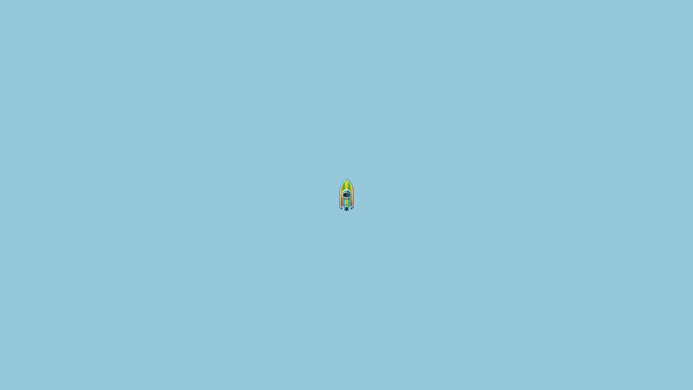
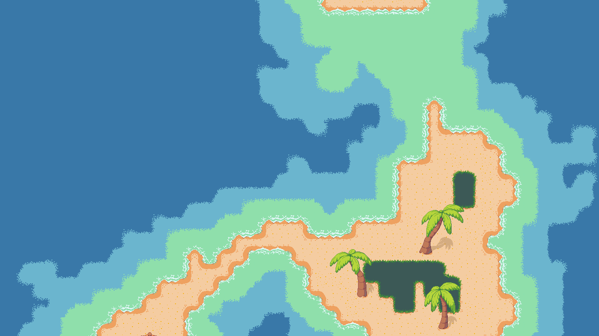
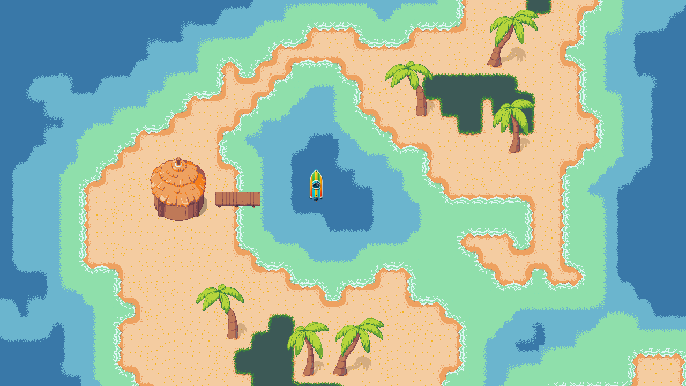
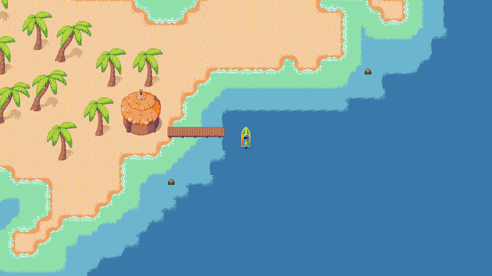

# WaveEngine

A small, deliberately scoped 2D engine built in C++17 using SDL2.  
Each phase introduces one core engine system in isolation.

---

## Phases

### Phase 00 — Engine Bootstrap
**Goal:** Validate the foundation: window, renderer, asset loading.

- SDL2 window creation (high-DPI)
- Minimal render loop
- Texture loading from shared `assets/`

▶ See: [projects/phase_00_engine_bootstrap/README.md](projects/phase_00_engine_bootstrap/README.md)

---

### Phase 01 — Tilemap Rendering
**Goal:** Load and render a real Tiled map with a 32×32 atlas.

- Load a Tiled JSON map from disk (`assets/tiles/ww-16k.json`)
- Decode base64 + zlib tile layers
- Render a 32×32 atlas (`assets/tiles/16k-waves-trans-atlas.png`) using SDL2
- Validate world-scale rendering against a known working GDevelop project

▶ See: [projects/phase_01_tilemap_rendering/README.md](projects/phase_01_tilemap_rendering/README.md)

---

### Phase 02 — Player Movement
**Goal:** Introduce a controllable player entity using simple, deterministic movement.

- Render a player boat sprite (`assets/boat-64.png`) on top of the tilemap
- Frame-rate–independent movement using `std::chrono`
- WSAD keyboard controls with normalized diagonal movement
- Shared world → screen transform with the tilemap
- No acceleration or physics yet (intentionally deferred)

▶ See: [projects/phase_02_player_movement/README.md](projects/phase_02_player_movement/README.md)

---

### Phase 03 — Camera Follow
**Goal:** Introduce a smooth, player-centric camera system with inertial movement.

- Camera follows the player boat with configurable smoothing
- Exponential interpolation (lerp) for natural camera inertia
- Optional follow toggle for debugging and comparison
- Camera deadzone to delay movement until the player drifts from center
- Frame-rate–independent camera updates
- FPS counter added to establish a performance baseline before chunking
- Uses the full island tilemap (`ww-16k-all-islands.json`) to stress test rendering

▶ See: [projects/phase_03_camera_follow/README.md](projects/phase_03_camera_follow/README.md)

---
